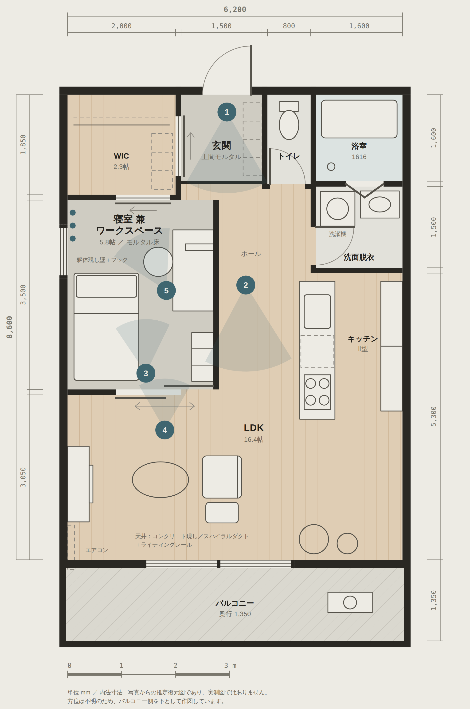

# 写真からの推定間取り図 — インダストリアルな1LDK

Instagram のストーリーズ投稿のスクリーンショット5枚をもとに、各室のつながりを読み取って
起こした 1LDK の**推定復元間取り図**です。実測図ではありません。



## 成果物

| ファイル | 内容 |
| --- | --- |
| `floorplan/1ldk-industrial.svg` | 間取り図本体。単体で開けるスタンドアロン SVG（ライト／ダーク両対応） |
| `floorplan/1ldk-industrial.png` | 共有用の PNG（幅 2000px、ライトテーマ） |
| `floorplan/index.html` | 図面 ＋ 写真との対応 ＋ 面積表 ＋ 推定確度をまとめた閲覧ページ |
| `floorplan/page.template.html` | 上記ページのテンプレート（`<!--PLAN_SVG-->` に SVG が差し込まれる） |
| `floorplan/build.py` | テンプレートに SVG をインライン展開して `index.html` を生成 |

## ビルド

`index.html` は生成物です。SVG かテンプレートを編集したら再生成してください。

```sh
python3 floorplan/build.py
```

スタンドアロン SVG は自前の `:root` テーマ定義を持っています。インライン展開時には
その `<style id="plan-standalone-theme">` ブロックが取り除かれ、ページ側のトークンが
効くようになります（`:root` は HTML 文書内では `<html>` を指してしまうため）。

## 想定した構成

間口 6,200 × 奥行 8,600 mm、専有面積 約 56.0 ㎡（壁芯・推定）。

- 玄関はモルタルの土間。片側にオープンのシューズラック、反対側にウォークインクローゼット
- クローゼットは玄関側と寝室側の両方から出入りできる回遊配置
- 水まわり（浴室・洗面脱衣室・トイレ）は玄関の片側にまとめ
- 寝室兼ワークスペース 5.8 帖はモルタル床で、大開口の引戸で LDK とつながる
- LDK 16.4 帖。キッチンは Ⅱ型で、掃き出し窓の先がバルコニー

## 確度について

写真から直接読み取れたのは、床仕上げの切り替わり、LDK と寝室が大開口の引戸で
つながること、キッチンが Ⅱ型であること、天井が躯体現しであること、玄関収納の
左右関係などです。

一方で**寸法と面積はすべて仮に置いた値**であり、**浴室・洗面脱衣室・トイレは
5枚のいずれにも写っていない**ため位置も大きさも仮定です。方位も判断材料が
ないため、バルコニー側を下として作図しています。詳細は `floorplan/index.html`
の「どこまでが写真で、どこからが推定か」を参照してください。

## 出典

Instagram [@renoveru](https://www.instagram.com/renoveru/) のストーリーズ投稿の
スクリーンショット（IMG_0182 / 0183 / 0185 / 0186 / 0187）より作図。
本図は写真をもとに第三者が起こした非公式の推定図であり、実際の物件図面ではありません。

---

## 別の成果物

- [`daytrip-atami/`](daytrip-atami/) — 熱海・初島の日帰りしおり（2026年9月13日・東京発）
