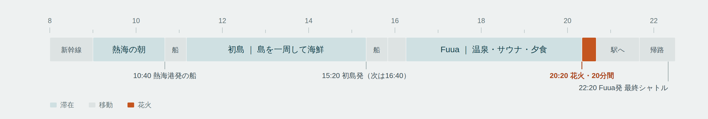

# 熱海・初島 日帰りしおり — 2026年9月13日（日）

東京発・2人・電車移動の日帰り行程です。高速船で初島に渡って島を一周し、熱海に戻って
オーシャンスパ Fuua で温泉とサウナ、そのまま露天風呂から熱海海上花火大会を見て帰ります。



## 成果物

| ファイル | 内容 |
| --- | --- |
| `daytrip-atami/route.svg` | 一日の行程図。単体で開けるスタンドアロン SVG（ライト／ダーク両対応） |
| `daytrip-atami/route.png` | README・共有用の PNG（幅 2560px、ライトテーマ） |
| `daytrip-atami/index.html` | しおり本体。行程図 ＋ タイムライン ＋ 費用 ＋ 持ちもの ＋ 代替案 ＋ 確度 |
| `daytrip-atami/page.template.html` | 上記ページのテンプレート（`<!--ROUTE_SVG-->` に SVG が差し込まれる） |
| `daytrip-atami/build.py` | テンプレートに SVG をインライン展開して `index.html` を生成 |

## ビルド

`index.html` は生成物です。SVG かテンプレートを編集したら再生成してください。

```sh
python3 daytrip-atami/build.py
```

スタンドアロン SVG は自前のテーマ定義（`<style id="route-standalone-theme">`）を持っています。
インライン展開時にそのブロックは取り除かれ、ページ側のトークンが効くようになります。

## 条件と、日付を決めた理由

出発地は東京、2人、移動は電車・公共交通、時期は9月の土日、希望は「自然・絶景でリフレッシュ」と
「温泉・サウナ」。この条件から 2026年9月13日（日）を選びました。

- 2026年度の秋季熱海海上花火大会は 9/13・10/12・10/25・11/8・11/23 の5回で、9月に当たるのは13日だけ
- Fuua のかけ流し露天湯は花火会場が正面にあり、湯に浸かったまま見られる
- 熱海港 10:40 の高速船で初島へ渡り、15:20 の便で戻れば、Fuua にも花火にも余裕で間に合う

一日の形は、動かせない四つの時刻 ── 行きの船（10:40）、帰りの船（15:20）、花火（20:20）、
Fuua を出る最終シャトル（22:20）── で決まります。その間に、島の四時間と湯の四時間が収まります。

費用は2人で約38,700円（1人 約19,300円）の見込みです。

## 確度について

裏を取れたのは、花火の日程と時刻、Fuua の料金と花火開催日の料金形態、熱海駅との無料シャトルの
運行時間帯、高速船の時刻と往復運賃、初島の遊歩道と灯台、アタミロープウェイと來宮神社の基本情報、
東京〜熱海の所要時間と自由席運賃です。

一方で**当日の具体的な列車時刻、とくに帰りの熱海発の最終は確定できていません**。高速船は波で
欠航することがあり、花火も荒天なら順延です。何が確認済みで何がそうでないかは
`daytrip-atami/index.html` の「どこまで裏を取って、どこからが要確認か」にまとめてあります。

欠航・雨天時の代替（來宮神社 ＋ アタミロープウェイ ＋ Fuua ＋ 花火）と、花火のない土日に行く
場合の組み替えも同じページに入れてあります。

## 出典

熱海市公式ウェブサイト、あたみニュース（熱海市観光サイト）、オーシャンスパ Fuua ／
ATAMI BAY RESORT KORAKUEN、初島リゾートライン、初島区事業協同組合、アタミロープウェイ、
來宮神社、駅探。個別の URL は `daytrip-atami/index.html` の「出典」に記載しています。

本しおりは公開情報をもとに組んだ非公式の行程案です。料金・時刻・営業日は変わります。
