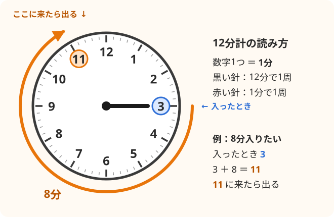

# サウナの時計メモ（12分計の読み方・振動で知らせる時計）

## 12分計の読み方

サウナ室の丸い時計は、**今の時刻ではなく「何分たったか」を見る時計**。

- **黒い針**：12分で1周する。**数字が1つ進んだら1分**。
- **赤い針**：1分で1周する（秒針と同じ）。
- **使い方**：入ったときに黒い針がどの数字にあるか覚えておく。
  **出る数字 ＝ 入ったときの数字 ＋ 入りたい分数**。12を超えたら12を引く。

| 入ったとき | 入りたい時間 | 出る数字 |
| :---: | :---: | :---: |
| 3 | 8分 | 3＋8＝**11** |
| 9 | 6分 | 9＋6−12＝**3** |
| 12 | 7分 | **7** |

- 最初は **6〜8分** くらいで十分。
- 時間より「もう出たいな」という体の声を優先する。

## 時計をつけてサウナに入っていい？

**普通の腕時計・スマートウォッチはサウナ室に持ち込まない。**

- **カメラ付きの機械は禁止の施設が多い**。スマホや、カメラ付きのスマートウォッチは盗撮防止のため持ち込み禁止にしている施設が多い。
- **熱で壊れるし、火傷の危険もある**。
  - Apple Watch が動く前提の気温は 0〜35℃。サウナは 80〜100℃ある。
  - 金属の時計は熱くなって肌を火傷することがある。
  - 防水の時計でも、熱い蒸気で壊れることがある。
- **決まりは施設ごとに違う**ので、フロントで確認する。
  おふろの王様 和光店の決まりはまだ確認していない。

## 振動で知らせてくれるサウナ用の時計

| | ととのいタイマー（ZEN STATE） | カシオ サ時計（SAN-100H） |
| --- | --- | --- |
| 知らせ方 | **振動でブルッと知らせる** | 振動なし（針を見るタイプ） |
| 熱 | 100℃の試験をクリア（メーカーの説明） | 100℃までのサウナで使える |
| 水 | IPX7（水風呂もそのまま入れる） | 5気圧防水 |
| 便利なところ | サウナ→水風呂→休憩のタイマーが自動で切り替わる。それぞれ12分まで1分単位で設定できる | ボタン一つで普通の時計と12分計を切り替えられる |
| 値段 | 12,800円（セールで安くなることもある） | 16,500円 |

- 「振動で知りたい」なら **ととのいタイマー** がぴったり。
- 見た目がスマートウォッチっぽいので、初めての施設ではフロントで聞く。
  「カメラの付いていないサウナ用タイマーですが、つけて入っていいですか？」
- **100℃を超えるサウナでは外す。**
- 値段は 2026年9月に調べたもの。買う前に確認する。

## お金をかけない裏ワザ：頭の中で演歌

- 演歌は1曲だいたい4分前後。**2曲でだいたい8分**。
- 歌うのは頭の中だけ。サウナは黙って入るのがマナー。

## 気をつけること

- **お酒はサウナが全部終わってから飲む。** 飲んでからサウナに入るのは危ない。
- 気分が悪くなったら、時間の途中でもすぐ出る。

## 出典

- [サウナ時計（サウナタイマー）が12分の理由と見方](https://jobpal.jp/contents/column/product/003/)
- [【早見表付き】サウナの12分計とは？読み方・使い方](https://toto-sauna.com/sauna-knowledge/sauna-12funkei/)
- [Apple Watchが快適に動作する気温（ITmedia）](https://www.itmedia.co.jp/fav/spv/2409/19/news073.html)
- [サウナでスマホ・スマートウォッチは壊れる？（LOCA THA CLASS）](https://loca-aoyama.jp/column/2025/09/30/post-6789/)
- [サウナで腕時計はマナー違反？](https://oneday-onsen.com/sauna-watch-manner/)
- [「ととのい」を振動で知らせるタイマー（ROOMIE）](https://www.roomie.jp/2026/08/1873029/)
- [ZEN STATE ととのいタイマー TMS4203（GDT）](https://www.gdt.co.jp/products/goods/others-goods/products-1259/)
- [ととのいタイマー Makuake開始（PR TIMES）](https://prtimes.jp/main/html/rd/p/000000009.000166977.html)
- [カシオ サ時計（公式）](https://www.casio.com/jp/sadokei/)
- [カシオ、サウナ専用「サ時計」発売（Impress Watch）](https://www.watch.impress.co.jp/docs/news/2051123.html)
