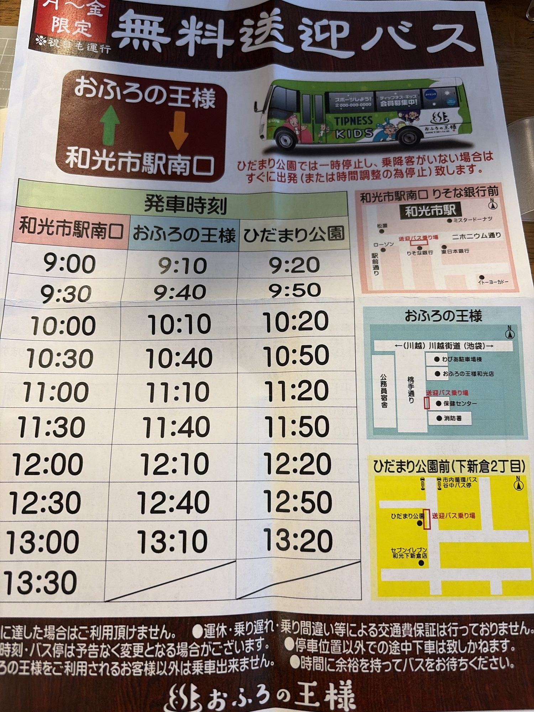
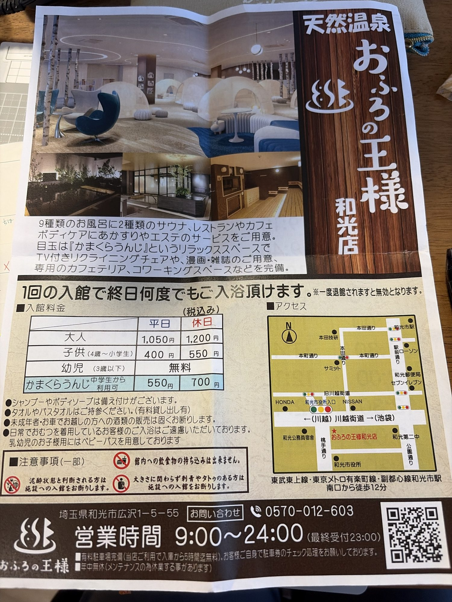

# 天然温泉 おふろの王様 和光店（埼玉・和光市）

> **平日がお気に入り**。
> 風呂9種類＋サウナ2種類。行きは無料送迎バス、帰りは歩きがいちばん。

## ハツの攻略メモ

- **行き＝無料送迎バス、帰り＝歩き**
  - バスは和光市駅南口（りそな銀行前）から 30分おき。
  - おふろの王様から出るバスは **13:10 が最終**。のんびりしたら帰りは歩くしかない。
  - 王様発のバスはひだまり公園を回ってから駅に戻る便なので、
    時刻表の間隔から見て駅まで 20分くらいかかる。
    歩けば 12〜15分なので、帰りは歩いたほうが早い。
- **帰り道でダイソー・セリアに寄り道**できるのも歩きのいいところ。
- **平日に行く**：大人 1,050円（休日は 1,200円）。
  送迎バスも走るのは月〜金（祝日も運行）だけ。
  ※ 祝日はバスは出るけど、料金は休日料金になると思われる（未確認）。
- **タオル・ワンピは持参**して安上がり。
  - タオル・バスタオルは持参が前提（有料の貸し出しもある）。
  - シャンプー・ボディソープは備え付けがあるので持っていかなくてOK。
  - 持っていくもの：タオル、バスタオル、館内でくつろぐ用のワンピ。
  - 平日なら **入館料 1,050円＋バス 0円＝1,050円** で済む。
- **かまくらうんじは基本いらない**（平日 +550円、休日 +700円）。
  - 中身：TV付きリクライニングチェア、漫画・雑誌、専用カフェテリア、コワーキングスペース。
  - 風呂とサウナが目当ての日は不要。
  - 半日こもって寝転ぶ日、パソコンで仕事を片付けたい日は付けてもいい
    （付けると平日合計 1,600円）。
- **お酒**：車で来た人には売ってもらえないが、バスと歩きなら大丈夫。
  - 飲むのはサウナが全部終わってから。飲んでからサウナに入るのは危ない。
  - 泥酔していると判断されると入館を断られるので、ほどほどに。
- **サウナ用の時計**：サウナ室に時計をつけて入っていいかはまだ確認していない。
  次に行ったらフロントで聞く（→ [サウナの時計メモ](sauna-tokei.md)）。

## 基本情報

| 項目 | 内容 |
| --- | --- |
| 住所 | 埼玉県和光市広沢1-5-55 |
| 電話（問い合わせ） | 0570-012-603 |
| 営業時間 | 9:00〜24:00（最終受付 23:00） |
| 休み | 年中無休（メンテナンスで休業する日あり） |
| 最寄り駅 | 東武東上線・東京メトロ有楽町線・副都心線「和光市駅」南口から徒歩12分 |
| 車 | 有料駐車場あり（利用者は入庫から5時間まで無料。駐車券のチェック処理は自分で） |
| 設備 | お風呂9種類、サウナ2種類、レストラン、カフェ、あかすり、エステ |

### 入館料金（税込み）

1回の入館で終日何度でも入浴できる。一度退館すると無効。

| 区分 | 平日 | 休日 |
| --- | ---: | ---: |
| 大人 | **1,050円** | 1,200円 |
| 子供（4歳〜小学生） | 400円 | 550円 |
| 幼児（3歳以下） | 無料 | 無料 |
| かまくらうんじ（中学生から利用可・追加料金） | 550円 | 700円 |

### 注意事項（チラシより一部）

- 館内への飲食物の持ち込みは不可。
- 泥酔状態と判断される人は入館不可。
- 大きさに関わらず刺青やタトゥーのある人は入館不可。
- 未成年とお車で来た人への酒類の販売はしない。
- 日常的におむつを着用している人の入浴は不可（乳幼児用のベビーバスあり）。

## 無料送迎バス時刻表

**月〜金限定（祝日も運行）**。土日は走らない。

ルートは **和光市駅南口 → おふろの王様 → ひだまり公園 → 和光市駅南口** の循環。
下の時刻はすべて各乗り場の**発車時刻**。

| 和光市駅南口 発 | おふろの王様 発 | ひだまり公園 発 |
| :---: | :---: | :---: |
| 9:00 | 9:10 | 9:20 |
| 9:30 | 9:40 | 9:50 |
| 10:00 | 10:10 | 10:20 |
| 10:30 | 10:40 | 10:50 |
| 11:00 | 11:10 | 11:20 |
| 11:30 | 11:40 | 11:50 |
| 12:00 | 12:10 | 12:20 |
| 12:30 | 12:40 | 12:50 |
| 13:00 | **13:10（王様発の最終）** | 13:20 |
| **13:30（駅発の最終）** | — | — |

### 乗り場

| 乗り場 | 場所 |
| --- | --- |
| 和光市駅南口 | **りそな銀行前**。駅前通りとニホニウム通りの角あたり。近くにローソン、東日本銀行、ミスタードーナツ |
| おふろの王様 | 店の南側、**桃手通り沿いの保健センター前**（消防署の北隣） |
| ひだまり公園前（下新倉2丁目） | ひだまり公園の脇。セブンイレブン和光下新倉店の北側、市内循環バス谷中バス停の近く |

ひだまり公園では一時停止し、乗り降りする人がいなければすぐに出発
（または時間調整のために停車）する。

### バスの注意（チラシより）

- おふろの王様を利用する人以外は乗れない。
- 定員に達したら乗れない（チラシの端が切れていて一部推測）。
- 決まった乗り場以外での途中下車はできない。
- 時刻・バス停は予告なく変更されることがある。
- 運休・乗り遅れ・乗り間違いなどによる交通費の保証はない。
- 時間に余裕を持ってバスを待つこと。

## チラシの写真

時刻・料金は受け取ったチラシの内容。変わることがあるので、行く前に公式サイトか電話で確認すること。

| 送迎バス時刻表 | 店舗案内・料金 |
| :---: | :---: |
|  |  |
